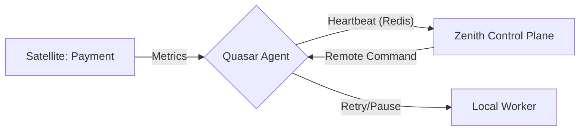

# @gravito/quasar

Universal system monitoring agent for Gravito Zenith. Provides comprehensive monitoring for Node.js/Bun applications including system metrics, queue statistics, and real-time job execution tracking.

## ✨ Features

### 🔍 Galaxy-Ready Telemetry
- 🪐 **Native PlanetCore Agent**: Seamlessly reports health and metrics from any Gravito service instance.
- **System Monitoring**: CPU, memory, and process metrics (cached for performance) with Bun-native support.
- **Automatic Heartbeat**: Reliable reporting with adaptive intervals to minimize network overhead.

### 📊 Distributed Worker Bridges
- **Real-time Job Tracking**: Detailed execution logs for BullMQ, Bull, Bee-Queue, and Laravel.
- **Queue Probes**: Monitor statistics from Kafka (Lag), RabbitMQ, AWS SQS, and Redis.
- **🎮 Remote Execution**: Bridge for management commands from the Zenith dashboard (Retry, Pause, Resume).

## 🌌 Role in Galaxy Architecture

In the **Gravito Galaxy Architecture**, Quasar acts as the **Heartbeat Agent (Telemetry Link)**.

- **Galaxy Sensor**: Injects monitoring capabilities into every Satellite and Orbit without polluting business logic.
- **Unified Feedback Loop**: Connects isolated service instances to the `Zenith` Control Plane, enabling real-time operational awareness.
- **Performance Messenger**: Propagates local resource utilization and queue metrics to the central Observability cluster.



Features:
- Job lifecycle events (started, completed, failed)
- Error stack traces
- Progress updates
- Execution context
- **Batch log buffering** for high performance

### 🎮 Remote Control
Execute management commands from Zenith dashboard:
- Retry failed jobs
- Delete jobs
- Pause/Resume queues
- Clean queues
- Prioritize jobs

### 🏥 Health Check
- Built-in HTTP health check server
- Kubernetes Liveness/Readiness probe support

## Installation

```bash
npm install @gravito/quasar ioredis
# or
bun add @gravito/quasar ioredis
```

Optional dependencies for specific probes:
```bash
bun add @aws-sdk/client-sqs # For SQS
```

## Quick Start

### Basic System Monitoring

```typescript
import { QuasarAgent } from '@gravito/quasar'

const agent = new QuasarAgent({
  service: 'my-app',
  transport: { url: 'redis://zenith-server:6379' }
})

await agent.start()
```

### Queue Statistics Monitoring

```typescript
import { QuasarAgent } from '@gravito/quasar'

const agent = new QuasarAgent({
  service: 'my-app',
  transport: { url: 'redis://zenith-server:6379' },
  monitor: { url: 'redis://localhost:6379' } // Local queue Redis
})

// Monitor queue statistics
agent.monitorQueue('emails', 'bullmq')
agent.monitorQueue('notifications', 'bee-queue')
agent.monitorQueue('default', 'laravel')

// RabbitMQ
import { RabbitMQProbe } from '@gravito/quasar/probes'
agent.addQueueProbe(new RabbitMQProbe({ url: 'http://localhost:15672' }, 'my-queue'))

await agent.start()
```

### Real-time Job Execution Tracking

```typescript
import { QuasarAgent } from '@gravito/quasar'
import { Worker } from 'bullmq'

const agent = new QuasarAgent({
  service: 'my-app',
  transport: { url: 'redis://zenith-server:6379' },
  monitor: { url: 'redis://localhost:6379' }
})

// Create your worker
const worker = new Worker('emails', async (job) => {
  // Your job logic
  console.log(`Sending email to ${job.data.to}`)
})

// Attach bridge for real-time monitoring
agent.attachBridge(worker, 'bullmq')

await agent.start()
```

### Health Check Server

```typescript
import { HealthServer } from '@gravito/quasar/health'

const agent = new QuasarAgent({ ... })
await agent.start()

const healthServer = new HealthServer(agent, 9999)
await healthServer.start()
// GET http://localhost:9999/health
```

## Configuration

### QuasarOptions

```typescript
interface QuasarOptions {
  // Service identifier (required)
  service: string
  
  // Optional custom name (defaults to hostname)
  name?: string
  
  // Redis connection for Zenith transport (required)
  transport?: {
    url?: string
    client?: Redis
    options?: any
  }
  
  // Redis connection for local queue monitoring (optional)
  monitor?: {
    url?: string
    client?: Redis
    options?: any
  }
  
  // Heartbeat interval in milliseconds (default: 10000)
  interval?: number
  
  // Custom system probe (optional)
  probe?: Probe
  
  // Custom Logger
  logger?: Logger
}
```

## Advanced Usage

### Custom System Probe

```typescript
import { QuasarAgent } from '@gravito/quasar'
import type { Probe, SystemMetrics } from '@gravito/quasar'

class CustomProbe implements Probe {
  async getMetrics(): Promise<SystemMetrics> {
    return {
      cpu: { /* ... */ },
      memory: { /* ... */ },
      pid: process.pid,
      hostname: os.hostname(),
      platform: process.platform,
      uptime: process.uptime()
    }
  }
}

const agent = new QuasarAgent({
  service: 'my-app',
  transport: { url: 'redis://zenith:6379' },
  probe: new CustomProbe()
})
```

### Generic Bridge (EventEmitter)

```typescript
import { EventEmitter } from 'events'
const myQueue = new EventEmitter()

agent.attachBridge(myQueue, 'generic', {
  eventMapping: {
    started: 'job:start',
    completed: 'job:done',
    failed: 'job:fail'
  },
  queueName: 'custom-queue'
})
```

## Architecture

### Probes vs Bridges

| Feature | Probe | Bridge |
|---------|-------|--------|
| **Purpose** | Queue statistics | Job execution tracking |
| **Data source** | Redis/API (external scan) | Worker events (internal hooks) |
| **What you see** | "5 jobs waiting" | "Job X failed with error Y" |
| **Update frequency** | Every 10s (configurable) | Real-time (buffered) |
| **Setup** | `agent.monitorQueue()` | `agent.attachBridge()` |
| **Performance impact** | Minimal (periodic scan) | Optimized (batch sending) |

**Recommendation**: Use both for complete visibility.

## License

MIT

## Related Packages

- `@gravito/zenith` - Zenith monitoring dashboard
- `@gravito/stream` - Native Gravito queue system with built-in monitoring
- `gravito/laravel-zenith` - Laravel integration package
