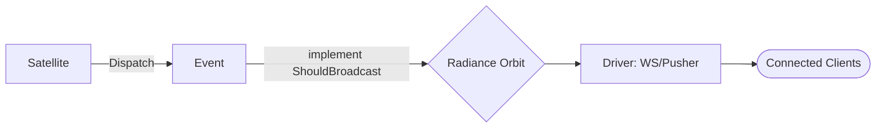

# @gravito/radiance

Lightweight, high-performance broadcasting for Gravito with multiple drivers (Pusher, Ably, Redis, WebSocket).

**Status**: v0.1.0 - core features complete with multiple broadcast drivers.

## ✨ Features

- 🪐 **Galaxy-Ready Broadcasting**: Native integration with PlanetCore events for automatic real-time delivery.
- 🔌 **Multi-Driver Support**: Seamlessly switch between **Pusher**, **Ably**, **Redis**, and native **WebSockets**.
- 📡 **Cross-Satellite Sync**: Synchronize state across multiple isolated Satellite instances.
- 🛡️ **Channel Authorization**: Built-in support for Private and Presence channels with granular auth logic.
- 🚀 **Zero Runtime Overhead**: Pure type-safe wrappers designed for maximum performance on Bun.

## 🌌 Role in Galaxy Architecture

In the **Gravito Galaxy Architecture**, Radiance acts as the **Event Horizon Layer (State Synchronization)**.

- **Real-time Interface**: Connects the internal events of the Galaxy to external observers (Clients) via persistent connections.
- **Satellite Interconnect**: Allows Satellites to broadcast state changes that other Satellites' frontend components can react to instantly.
- **Presence Core**: Manages the "Who is Online" state across the entire ecosystem, enabling collaborative features.



## Installation

```bash
bun add @gravito/radiance
```

## Quick Start

### 1. Configure OrbitRadiance

```typescript
import { PlanetCore } from '@gravito/core'
import { OrbitRadiance } from '@gravito/radiance'

const core = await PlanetCore.boot({
  orbits: [
    OrbitRadiance.configure({
      driver: 'pusher',
      config: {
        appId: 'your-app-id',
        key: 'your-key',
        secret: 'your-secret',
        cluster: 'mt1',
      },
      authorizeChannel: async (channel, socketId, userId) => {
        // Implement channel auth logic here
        return true
      },
    }),
  ],
})
```

### 2. Create a broadcastable event

```typescript
import { Event, ShouldBroadcast } from '@gravito/core'
import { PrivateChannel } from '@gravito/radiance'

class OrderShipped extends Event implements ShouldBroadcast {
  constructor(public order: Order) {
    super()
  }

  broadcastOn(): PrivateChannel {
    return new PrivateChannel(`user.${this.order.userId}`)
  }

  broadcastWith(): Record<string, unknown> {
    return {
      order_id: this.order.id,
      status: 'shipped',
      tracking_number: this.order.trackingNumber,
    }
  }

  broadcastAs(): string {
    return 'OrderShipped'
  }
}
```

### 3. Dispatch events (auto broadcast)

```typescript
await core.events.dispatch(new OrderShipped(order))
```

### 4. Manual broadcast

```typescript
const broadcast = c.get('broadcast') as BroadcastManager

await broadcast.broadcast(
  event,
  { name: 'user.123', type: 'private' },
  { message: 'Hello' },
  'CustomEvent'
)
```

## Drivers

### Pusher

```typescript
OrbitRadiance.configure({
  driver: 'pusher',
  config: {
    appId: 'your-app-id',
    key: 'your-key',
    secret: 'your-secret',
    cluster: 'mt1',
    useTLS: true,
  },
})
```

### Ably

```typescript
OrbitRadiance.configure({
  driver: 'ably',
  config: {
    apiKey: 'your-api-key',
  },
})
```

### Redis

```typescript
import { RedisDriver } from '@gravito/radiance'

const redisDriver = new RedisDriver({
  url: 'redis://localhost:6379',
})

redisDriver.setRedisClient(redisClient)

OrbitRadiance.configure({
  driver: 'redis',
  config: {
    url: 'redis://localhost:6379',
    keyPrefix: 'gravito:broadcast:',
  },
})
```

### WebSocket

```typescript
OrbitRadiance.configure({
  driver: 'websocket',
  config: {
    getConnections: () => {
      return Array.from(websocketConnections.values())
    },
    filterConnectionsByChannel: (channel) => {
      return Array.from(websocketConnections.values()).filter(
        (conn) => conn.subscribedChannels.includes(channel)
      )
    },
  },
})
```

## Channel Types

### Public

```typescript
import { PublicChannel } from '@gravito/radiance'

class PublicEvent extends Event implements ShouldBroadcast {
  broadcastOn(): PublicChannel {
    return new PublicChannel('public-channel')
  }
}
```

### Private

```typescript
import { PrivateChannel } from '@gravito/radiance'

class PrivateEvent extends Event implements ShouldBroadcast {
  broadcastOn(): PrivateChannel {
    return new PrivateChannel(`user.${this.userId}`)
  }
}
```

### Presence

```typescript
import { PresenceChannel } from '@gravito/radiance'

class PresenceEvent extends Event implements ShouldBroadcast {
  broadcastOn(): PresenceChannel {
    return new PresenceChannel('presence-room')
  }
}
```

## Channel Authorization

Private and presence channels require authorization.

```typescript
OrbitRadiance.configure({
  driver: 'pusher',
  config: { /* ... */ },
  authorizeChannel: async (channel, socketId, userId) => {
    if (channel.startsWith('private-user.')) {
      const channelUserId = channel.replace('private-user.', '')
      return userId?.toString() === channelUserId
    }
    return false
  },
})
```

## 📚 Documentation

Detailed guides and references for the Galaxy Architecture:

- [🏗️ **Architecture Overview**](./README.md) — Multi-driver broadcasting.
- [📡 **Real-time Sync**](./doc/REAL_TIME_SYNC.md) — **NEW**: Syncing state across Satellites and Clients.
- [🛡️ **Channel Auth**](#channel-authorization) — Securing private and presence channels.

## API Reference

### BroadcastManager

#### Methods

- `broadcast(event, channel, data, eventName): Promise<void>` - Broadcast an event
- `authorizeChannel(channel, socketId, userId): Promise<{ auth, channel_data? } | null>` - Authorize channel access
- `setDriver(driver: BroadcastDriver): void` - Set the broadcast driver
- `setAuthCallback(callback: ChannelAuthorizationCallback): void` - Set the auth callback

### ShouldBroadcast

Events implementing `ShouldBroadcast` will be broadcast automatically:

- `broadcastOn(): string | Channel` - Broadcast channel (required)
- `broadcastWith?(): Record<string, unknown>` - Payload (optional)
- `broadcastAs?(): string` - Event name (optional)

## License

MIT © Carl Lee
