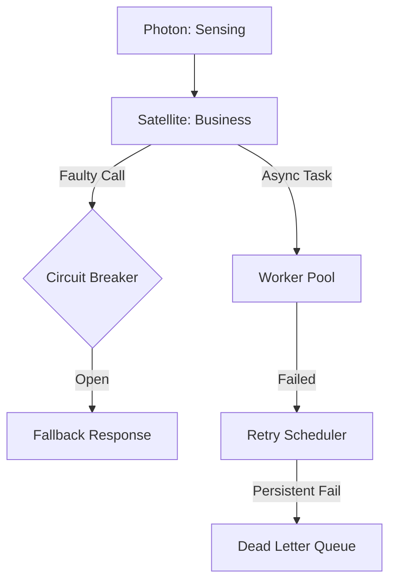

# @gravito/resilience

Event system resilience layer for Gravito framework - providing Circuit Breaker, Dead Letter Queue, Backpressure management, Worker Pool, and other reliability patterns.

## ✨ Features

- 🛡️ **Circuit Breaker**: Prevent cascading failures across Satellites with automatic state transitions.
- ⚙️ **Auto-scaling Worker Pools**: Native Bun worker implementation with dynamic scaling based on real-time load.
- 🔄 **Distributed Retry Scheduler**: Reliable task retries utilizing Bull Queue (Redis) for persistence.
- 📦 **Backpressure Management**: Intelligent flow control to protect your system from traffic spikes.
- 🎯 **Priority Queueing**: Ensure mission-critical tasks are processed first.
- 📊 **Observability**: Built-in OpenTelemetry integration for monitoring pool health and circuit states.
- 🧩 **Idempotency Support**: Safely retry operations without unintended side effects.

## 🌌 Role in Galaxy Architecture

In the **Gravito Galaxy Architecture**, Resilience acts as the **Guardian Layer (Immune System)**.

- **Satellite Isolation**: Ensures that a failure in one Satellite (e.g., `Catalog`) doesn't take down the entire Galaxy via circuit breakers.
- **Background Autopilot**: Manages the lifecycle of asynchronous tasks through its Worker Pool, offloading heavy processing from the `Photon` Sensing Layer.
- **Distributed Reliability**: Provides a unified interface for retries and DLQs that works across multiple process boundaries.



## Installation

```bash
bun add @gravito/resilience
```

## Usage

```typescript
import { CircuitBreaker, DeadLetterQueue, WorkerPool } from '@gravito/resilience'

// Use resilience components
const circuitBreaker = new CircuitBreaker({
  failureThreshold: 5,
  resetTimeout: 60000,
})
```

## 📚 Documentation

Detailed guides and references for the Galaxy Architecture:

- [🏗️ **Architecture Overview**](./README.md) — Resilience patterns and Guardian Layer.
- [⚙️ **Bun Worker Pool Guide**](./doc/BUN_WORKERS.md) — **NEW**: Dynamic scaling and multi-threaded processing.
- [🛡️ **Fault Tolerance Guide**](./doc/FAULT_TOLERANCE.md) — **NEW**: Circuit Breakers, Retry, and DLQ patterns.
- [📊 **Observability Guide**](./src/observability/index.ts) — Metrics and distributed tracing.
- [🔄 **Retry & Idempotency**](./src/retry/index.ts) — Reliable event delivery.

## Peer Dependencies

- `@gravito/core`: ^1.7.0
- `@opentelemetry/api`: ^1.9.0 (optional)

## License

MIT
