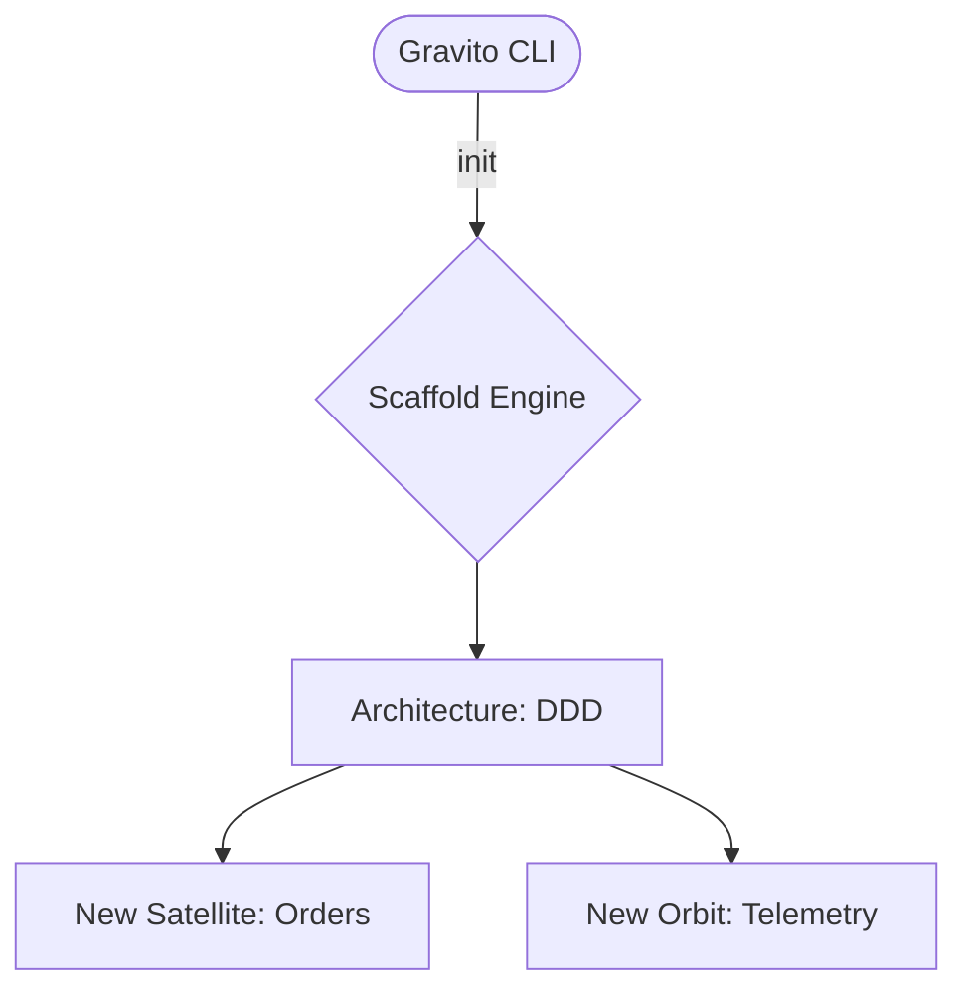

# @gravito/scaffold

Project scaffolding generators for Gravito Framework.

## Installation

```bash
bun add @gravito/scaffold
```

## Usage

### With CLI (Recommended)

```bash
npx gravito init my-app --architecture ddd
```

### Programmatic API

```typescript
import { Scaffold, type ScaffoldOptions } from '@gravito/scaffold'

const options: ScaffoldOptions = {
  name: 'my-app',
  architecture: 'ddd',
  targetPath: './my-app',
  packageManager: 'bun',
}

const scaffold = new Scaffold(options)
const result = await scaffold.generate()

console.log(`Created ${result.filesCreated} files`)
```

## ✨ Key Features

- 🪐 **Galaxy-Ready Scaffolding**: Native integration with the Gravito CLI to bootstrap new Satellites and Orbits instantly.
- 🏗️ **Architectural Blueprints**: Built-in support for **DDD**, **Clean Architecture**, and **Enterprise MVC** patterns.
- 🧩 **Satellite Templates**: Generate isolated, "plug-and-play" domain units with correct directory structures.
- 🛠️ **Stub Generator**: Highly customizable Handlebars-based engine for generating boilerplate-free code.
- 📂 **Directory Integrity**: Ensures that every new module follows the strict dependency rules of the Galaxy.

## 🌌 Role in Galaxy Architecture

In the **Gravito Galaxy Architecture**, Scaffold acts as the **Blueprint Engine (Constructive Core)**.

- **Galaxy Expansion**: Provides the "DNA" for creating new planets (Satellites) within the ecosystem, ensuring that every new piece of code is consistent with the framework's standards.
- **Structural Enforcement**: Automates the creation of `manifest.json`, `src/index.ts`, and `tests/` directories, preventing architectural drift.
- **Developer Onboarding**: Lowers the barrier to entry by providing ready-to-use "Starter Kits" for different domain complexities.



## Generators

### BaseGenerator

Abstract base class for all generators. Provides:
- Directory structure creation
- Package.json generation
- TypeScript configuration
- Environment files
- Architecture documentation

### StubGenerator

Handlebars-based template engine with built-in helpers:

```typescript
import { StubGenerator } from '@gravito/scaffold'

const generator = new StubGenerator()

// Register custom helper
generator.registerHelper('uppercase', (str) => str.toUpperCase())

// Render template
const result = generator.render('Hello {{uppercase name}}!', { name: 'world' })
// => "Hello WORLD!"
```

**Built-in Helpers:**
- `pascalCase` - Convert to PascalCase
- `camelCase` - Convert to camelCase
- `kebabCase` - Convert to kebab-case
- `snakeCase` - Convert to snake_case
- `upperCase` - Convert to UPPERCASE
- `lowerCase` - Convert to lowercase
- `pluralize` - Pluralize word
- `singularize` - Singularize word

## Extending

Create custom generators by extending `BaseGenerator`:

```typescript
import { BaseGenerator, type GeneratorContext, type DirectoryNode } from '@gravito/scaffold'

export class MyCustomGenerator extends BaseGenerator {
  getDirectoryStructure(context: GeneratorContext): DirectoryNode[] {
    return [
      {
        type: 'directory',
        name: 'src',
        children: [
          { type: 'file', name: 'index.ts', content: this.generateIndex(context) },
        ],
      },
    ]
  }

  protected generateArchitectureDoc(context: GeneratorContext): string {
    return `# ${context.name}\n\nMy custom architecture.`
  }

  private generateIndex(context: GeneratorContext): string {
    return `console.log('Hello from ${context.name}!')`
  }
}
```

## 📚 Documentation

Detailed guides and references for the Galaxy Architecture:

- [🏗️ **Architecture Overview**](./README.md) — Blueprint engine and structural integrity.
- [🏗️ **Galaxy Blueprints**](./doc/GALAXY_BLUEPRINTS.md) — **NEW**: DDD, Clean, and MVC starter kits.
- [🛠️ **Stub Customization**](#generators) — Building your own code generators.

## API Reference

### ScaffoldOptions

```typescript
interface ScaffoldOptions {
  name: string                    // Project name
  architecture: ArchitectureType  // Architecture pattern
  targetPath: string              // Output directory
  packageManager?: 'bun' | 'npm' | 'pnpm' | 'yarn'
  skipInstall?: boolean
  skipGit?: boolean
}
```

### ScaffoldResult

```typescript
interface ScaffoldResult {
  success: boolean
  projectPath: string
  filesCreated: number
  errors: string[]
}
```

### DirectoryNode

```typescript
interface DirectoryNode {
  type: 'file' | 'directory'
  name: string
  content?: string              // For files
  children?: DirectoryNode[]    // For directories
}
```

## License

MIT
