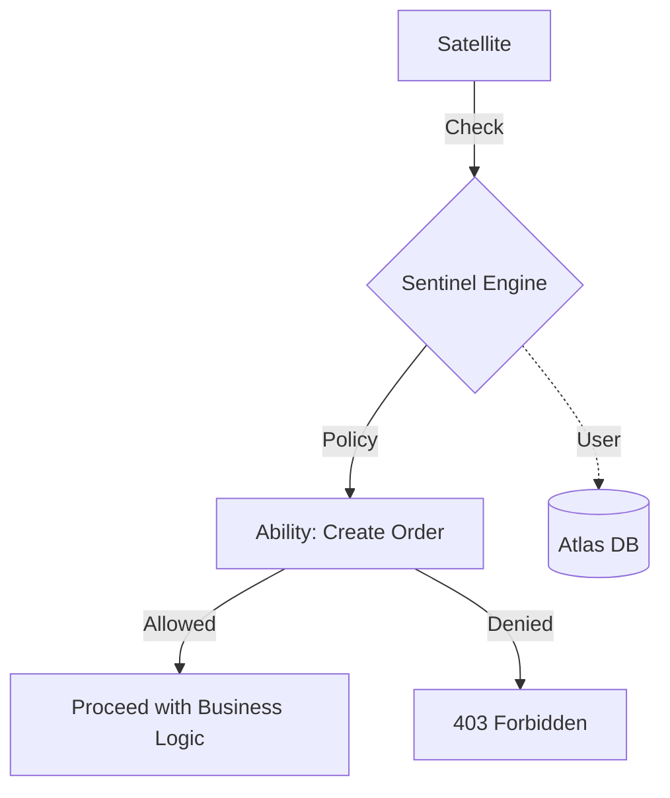

# @gravito/sentinel

Authentication and authorization orbit for Gravito Galaxy. Inspired by Laravel's auth system and designed for TypeScript.

## ✨ Features

- 🛡️ **Multiple Guards**: Session, JWT (with refresh tokens), and token-based authentication for diverse client types.
- 🌌 **Galaxy-Ready**: The "Identity Base" providing user context and security across all Gravito Satellites.
- 🔐 **Distributed RBAC/ABAC**: Define granular Gates and Policies that work across process boundaries.
- 🔄 **JWT Refresh System**: Built-in support for secure token rotation and blacklisting.
- 📦 **User Caching**: Optimized query performance with `CachedUserProvider` for high-traffic environments.
- 🛡️ **Brute-Force Protection**: Native `throttleAuth` middleware for secure login endpoints.

## 🌌 Role in Galaxy Architecture

In the **Gravito Galaxy Architecture**, Sentinel acts as the **Identity Base (Cellular DNA)**.

- **Identity Provider**: Supplies the user context that `Fortify` uses to shield the Galaxy.
- **Permission Core**: Defines the "Who can do What" rules (Gates & Policies) that govern interactions between Satellites.
- **Context Persistence**: Ensures that even in a distributed, stateless environment, the identity of the user remains consistent and verifiable.



## Installation

```bash
bun add @gravito/sentinel
```

## Migration from v3 to v4

### Breaking Changes

1. **CallbackUserProvider**: The fallback to `global.MOCK_USERS` has been removed. You must now provide a `retrieveByCredentialsCallback`.
2. **Middleware Types**: If you were using `any` in your middleware handlers, you should now use `GravitoContext` and `GravitoNext`.

```typescript
// v3
app.get('/admin', auth(), async (c: any, next: any) => { ... })

// v4
import type { GravitoContext, GravitoNext } from '@gravito/core'
app.get('/admin', auth(), async (c: GravitoContext, next: GravitoNext) => { ... })
```

### New Features

#### Remember Me
`SessionGuard` now supports a `remember` parameter in `login()` and `attempt()`.

```typescript
await auth.attempt(credentials, true) // Enable remember me
```

#### JWT Refresh Tokens
Use `JwtRefreshGuard` to generate and refresh token pairs.

```typescript
const tokens = await guard.createTokenPair(user)
// { accessToken, refreshToken, expiresIn }

const newTokens = await guard.refreshTokens(refreshToken)
```

#### Rate Limiting
Protect your login routes with `throttleAuth`.

```typescript
import { throttleAuth } from '@gravito/sentinel'

app.post('/login', throttleAuth({ maxAttempts: 5 }), async (c) => { ... })
```

## 📚 Documentation

Detailed guides and references for the Galaxy Architecture:

- [🏗️ **Architecture Overview**](./README.md) — Identity base and authentication guards.
- [🔐 **Identity & Auth**](./docs/IDENTITY_AND_AUTH.md) — **NEW**: Configuring guards, providers, and JWT refresh.
- [🛡️ **Auth Policies**](./docs/AUTHORIZATION_POLICIES.md) — **NEW**: Gates, Policies, RBAC, and ABAC strategies.
- [🔄 **Migration Guide**](#migration-from-v3-to-v4) — Upgrading from previous versions.

## License

MIT
