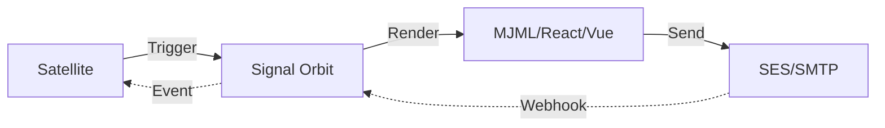

# @gravito/signal 🛰️

`@gravito/signal` is the powerful, multi-driver email framework for the Gravito ecosystem. It provides a clean, fluent API for building and sending emails with support for multiple rendering engines and transport drivers.

## ✨ Features

- 🚀 **Fluent API**: Expressive `Mailable` classes for building complex email messages with zero friction.
- 🌌 **Galaxy-Ready**: A native Gravito Orbit that integrates seamlessly into the IoC container and context.
- 🔌 **Multi-Driver Transport**: Support for SMTP, AWS SES, SendGrid, Log, and Memory drivers.
- 🎨 **Modern Rendering**: Design emails using **React**, **Vue**, **MJML**, or **Prism** templates.
- 📬 **Dev Mailbox UI**: Built-in visual interface at `/__mail` for local email inspection and debugging.
- ⚙️ **Distributed Queueing**: Automatic offloading to `@gravito/stream` for background delivery.
- 🛡️ **Webhook Processing**: Handle inbound delivery events (bounces, clicks) with ease.

## 🌌 Role in Galaxy Architecture

In the **Gravito Galaxy Architecture**, Signal serves as the **Communication Nervous System**.

- **Outbound Signal**: Satellites (domain plugins) trigger `Signal` to communicate with the outside world (users, other systems).
- **Inbound Feedback**: Signal processes Webhooks from providers to update the state of the Galaxy (e.g., marking an email as invalid in the `Membership` Satellite).
- **Event-Driven**: Leverages `@gravito/core`'s lifecycle to ensure emails are sent only after transactions are committed.



## 📦 Installation

```bash
bun add @gravito/signal
```

### Optional Dependencies

Depending on your transport or renderer choice, you may need additional packages:

```bash
# For AWS SES
bun add @aws-sdk/client-ses

# For React components
bun add react react-dom

# For Vue components
bun add vue @vue/server-renderer
```

## 🚀 Quick Start

### 1. Configure the Orbit

Register `OrbitSignal` in your Gravito application:

```typescript
import { PlanetCore } from '@gravito/core';
import { OrbitSignal, SmtpTransport } from '@gravito/signal';

const core = new PlanetCore();

const mail = new OrbitSignal({
  from: { name: 'Gravito Support', address: 'support@example.com' },
  transport: new SmtpTransport({
    host: 'smtp.mailtrap.io',
    port: 2525,
    auth: { user: '...', pass: '...' }
  }),
  devMode: process.env.NODE_ENV === 'development',
});

mail.install(core);
```

### 2. Create a Mailable

Extend the `Mailable` class to define your email:

```typescript
import { Mailable } from '@gravito/signal';

export class WelcomeEmail extends Mailable {
  constructor(private user: { name: string; email: string }) {
    super();
  }

  build() {
    return this
      .to(this.user.email)
      .subject('Welcome to Gravito!')
      .view('emails/welcome', { name: this.user.name });
  }
}
```

### 3. Send the Email

Access the mail service via the Gravito context:

```typescript
// In your route handler
const mail = c.get('mail');
await mail.send(new WelcomeEmail(user));
```

## 🛠️ Advanced Usage

### React & Vue Rendering

You can use modern frontend frameworks to design your emails:

```typescript
// React example
export class MonthlyReport extends Mailable {
  build() {
    return this
      .subject('Your Monthly Report')
      .react(ReportComponent, { data: this.data });
  }
}

// Vue example
export class InvoiceEmail extends Mailable {
  build() {
    return this
      .subject('Invoice #12345')
      .vue(InvoiceTemplate, { total: 100 });
  }
}
```

### Queueing Emails

For better performance, send emails asynchronously:

```typescript
const email = new WelcomeEmail(user)
  .onQueue('notifications')
  .delay(60); // Send after 60 seconds

await email.queue();
```

### Development Mailbox

When `devMode` is enabled, `OrbitSignal` intercepts all outgoing emails and stores them in memory. You can view them by navigating to `/__mail` (or your configured `devUiPrefix`) in your browser. This UI provides:
- A list of all intercepted emails.
- Preview of HTML and Plain Text content.
- Metadata view (Subject, To, From, etc.).

## 🔧 Configuration Options

The `MailConfig` object supports the following options:

| Option | Type | Description |
|---|---|---|
| `from` | `Address` | Default sender address. |
| `transport` | `Transport` | The transport driver to use. |
| `devMode` | `boolean` | Enable/disable email interception. |
| `viewsDir` | `string` | Path to template directory. |
| `devUiPrefix`| `string` | URL prefix for Dev UI (default: `/__mail`). |
| `translator` | `Function` | I18n translation function. |

## 📄 License

MIT © Carl Lee
