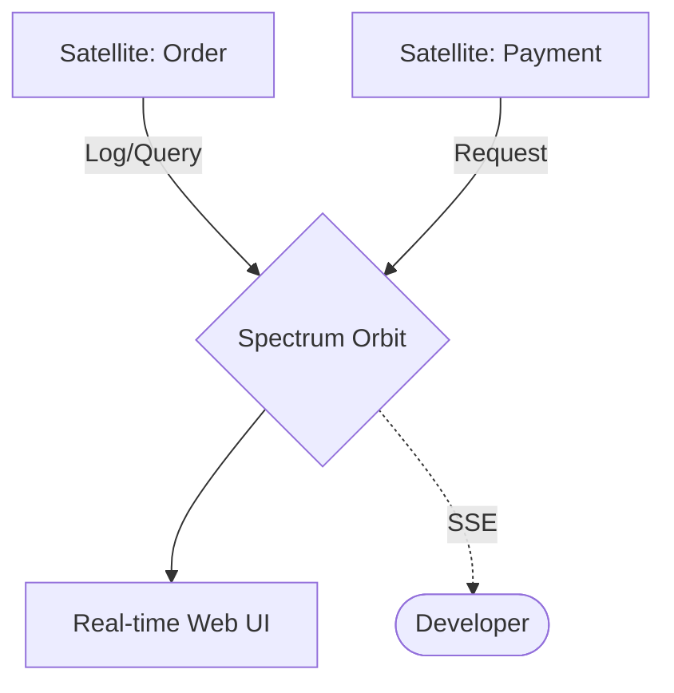

# @gravito/spectrum 🔭

> **Your telescope into the Gravito universe — real-time insights, zero configuration.**

`@gravito/spectrum` is a powerful, zero-config observability and debug dashboard designed specifically for the Gravito ecosystem. It acts as a telescope for your application, capturing HTTP requests, database queries, and application logs in real-time.


## ✨ Features

- **⚡️ Real-time Insights**: Observe HTTP requests, logs, and database queries across the Galaxy as they happen.
- **🔍 Request Correlation**: Automatically link logs and SQL queries to their originating request for deep debugging.
- **🌌 Galaxy-Wide Scope**: Capture events from multiple Satellites and Orbits in a single unified dashboard.
- **🗄️ Database Profiling**: Real-time inspection of SQL queries and execution duration via `@gravito/atlas`.
- **↺ Smart Replay**: One-click replay of any captured request to reproduce bugs in isolation.
- **🛡️ Debug Gates**: Secure the dashboard with built-in authorization middleware.

## 🌌 Role in Galaxy Architecture

In the **Gravito Galaxy Architecture**, Spectrum acts as the **Visual Telescope (Local Insights)**.

- **Developer Clarity**: Provides the "Eyes" needed during development to understand how isolated Satellites interact with each other and with the shared Orbits.
- **Event Correlation**: Leverages the Galaxy's internal `Signal` system to group related events (e.g., a Web request that triggers a background job and an email).
- **Optimization Lens**: Identifies slow queries or heavy middleware within the `Photon` Sensing Layer before they reach production.



## 📦 Installation

```bash
bun add @gravito/spectrum
```

## 🚀 Quick Start

Simply register the `SpectrumOrbit` in your application entry point:

```typescript
import { PlanetCore } from '@gravito/core'
import { SpectrumOrbit } from '@gravito/spectrum'

const core = new PlanetCore()

// Initialize Spectrum (Recommended for development only)
if (process.env.NODE_ENV !== 'production') {
  await core.orbit(new SpectrumOrbit())
}

await core.liftoff()
```

By default, visit **`http://localhost:3000/gravito/spectrum`** to access your dashboard.

## 📚 Documentation

Detailed guides and references for the Galaxy Architecture:

- [🏗️ **Architecture Overview**](./README.md) — Real-time debugging telescope.
- [🔭 **Local Insights**](./doc/LOCAL_INSIGHTS.md) — **NEW**: Request correlation and live inspection.
- [🛡️ **Production Safety**](#-production-safety) — Securing your debug data.

## ⚙️ Configuration

You can customize Spectrum by passing a configuration object to the `SpectrumOrbit` constructor.

```typescript
import { SpectrumOrbit, FileStorage } from '@gravito/spectrum'

await core.orbit(new SpectrumOrbit({
  // Custom dashboard path
  path: '/_debug',
  
  // Storage Strategy (MemoryStorage or FileStorage)
  storage: new FileStorage({ directory: './storage/spectrum' }), 
  
  // Maximum number of items to keep (per category)
  maxItems: 500,

  // Sample Rate (0.0 to 1.0)
  // 1.0 captures everything, 0.1 captures only 10% of traffic
  sampleRate: 1.0, 
  
  // Security Gate (Authorization)
  gate: async (c) => {
    // Return true to allow access, false to block
    const user = c.get('auth')?.user;
    return user?.isAdmin === true;
  }
}))
```

## 🛡️ Production Safety

Spectrum is optimized for local development. If you choose to enable it in production, please follow these security guidelines:

1.  **Always Configure a Gate**: Never leave the dashboard publicly accessible. Use the `gate` option to implement authentication.
2.  **Enable Persistence with Caution**: Use `FileStorage` to keep data across restarts, but monitor disk usage.
3.  **Adjust Sample Rate**: For high-traffic applications, set a lower `sampleRate` (e.g., `0.01` or 1%) to minimize performance overhead.

## 🔌 Integrations

### Database (Atlas)
Spectrum automatically detects `@gravito/atlas` if it's part of your orbits. It will begin capturing all SQL queries, allowing you to see exactly what's happening at the database level for every request.

### Logs (Logger)
Spectrum wraps the Gravito core logger. Any logs generated via `core.logger.info()`, `debug()`, `warn()`, or `error()` are captured and linked to the timeline of incoming requests.

## ❓ Spectrum vs Monitor

| Feature | `@gravito/spectrum` | `@gravito/monitor` |
|---------|---------------------|--------------------|
| **Primary Goal** | **Local Debugging & Profiling** | **Production Cluster Observability** |
| **Interface** | Built-in Web UI Dashboard | JSON / Prometheus / OpenTelemetry |
| **Data Scope** | Single Node (Stateful) | Distributed (Stateless) |
| **Retention** | Short-term (Recent items) | Long-term (TSDB Integration) |
| **Best For** | Developers fixing bugs locally | DevOps monitoring system health |

## 🛠️ Roadmap & Future Improvements

### Phase 1: Core Enhancement

| Feature | Description | Priority |
|---------|-------------|----------|
| **Request/Response Body Capture** | Capture and display request/response bodies with size limits and content-type filtering | High |
| **Advanced Filtering** | Add search, filter by method/status/duration in dashboard | High |
| **Export Functionality** | Export captured data as HAR, JSON, or CSV | Medium |
| **Request Diff View** | Compare two captured requests side-by-side | Medium |

### Phase 2: Storage & Performance

| Feature | Description | Priority |
|---------|-------------|----------|
| **SQLite Storage** | Add SQLite backend for better query performance and data integrity | High |
| **Batch Write Optimization** | Buffer writes and flush periodically to reduce I/O | Medium |
| **Memory Limit Controls** | Configurable memory caps with automatic pruning | Medium |
| **Compression** | GZIP compression for FileStorage to reduce disk usage | Low |

### Phase 3: Observability Integration

| Feature | Description | Priority |
|---------|-------------|----------|
| **OpenTelemetry Export** | Export traces to OTLP-compatible backends | High |
| **Trace Context Propagation** | Link requests to distributed traces | High |
| **Custom Span Annotations** | Allow manual span creation within request lifecycle | Medium |
| **Metrics Dashboard** | P50/P95/P99 latency charts, request rate graphs | Medium |

### Phase 4: Developer Experience

| Feature | Description | Priority |
|---------|-------------|----------|
| **Dark/Light Theme Toggle** | User-selectable theme for dashboard | Low |
| **Keyboard Shortcuts** | Navigate and filter with keyboard | Low |
| **WebSocket Support** | Capture and display WebSocket frames | Medium |
| **Request Timeline View** | Visual timeline showing request waterfall | Medium |
| **Mobile-Responsive Dashboard** | Improved mobile layout for dashboard | Low |

### Phase 5: Core Bug Fixes

| Issue | Description | Status | Priority |
|-------|-------------|--------|----------|
| **Request-Log-Query Correlation** | Link logs and queries to their originating request for better debugging | ✅ Fixed | High |
| **Config Consistency** | Ensure `SpectrumConfig.maxItems` is properly passed to Storage backends | ✅ Fixed | High |
| **FileStorage.prune()** | Currently only prunes requests, needs to handle logs and queries | ✅ Fixed | Medium |
| **SSE Connection Cleanup** | Improve handling of disconnected SSE clients to prevent memory leaks | ✅ Fixed | High |
| **Dashboard CSRF Protection** | Add CSRF protection for POST endpoints (`/clear`, `/replay`) | ✅ Fixed | High |
| **Large Payload Handling** | Implement streaming for large request/response bodies | ⏳ Planned | Medium |

### Contributing

We welcome contributions! Priority areas:
- Storage backend implementations (Redis, PostgreSQL)
- Dashboard UI improvements
- Performance optimizations for high-traffic scenarios

## 📄 License

MIT © Carl Lee
