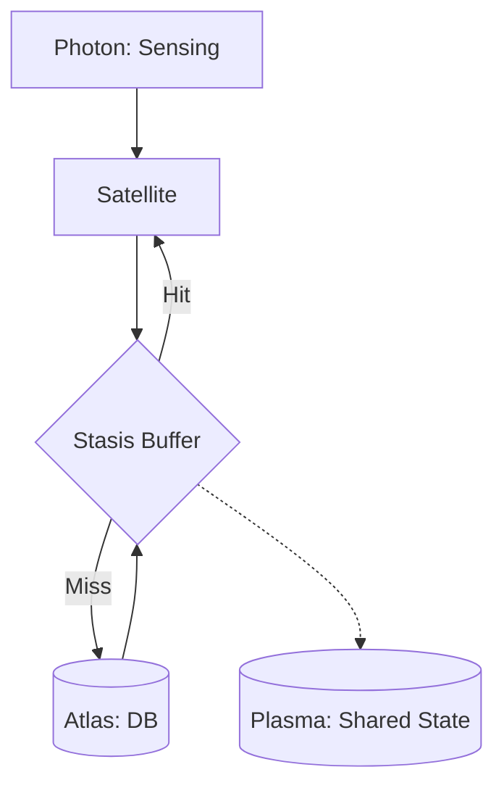

# @gravito/stasis 🧊

> High-performance Cache and State Management Orbit for Gravito.

`@gravito/stasis` wraps complex caching logic into an elegant and powerful API, ensuring your application handles high concurrency and massive datasets with ease.

---

## 📚 Documentation

Detailed guides and references for the Galaxy Architecture:

- [🏗️ **Architecture Deep Dive**](./docs/architecture.md) — Under the hood of tiered caching.
- [🧊 **Hybrid Caching**](./doc/HYBRID_CACHING.md) — **NEW**: L1/L2 strategy and predictive warming.
- [📊 **Observability**](./docs/observability.md) — Monitoring cache health and hit rates.

---

## 🌟 Core Capabilities
*   🚀 **Unified API**: Seamlessly switch between Memory, Redis, File, and other storage drivers.
*   🏗️ **Tiered Cache (Hybrid)**: Combine local Memory with distributed Redis for extreme read speeds.
*   🧠 **Predictive State Warming**: Access path prediction and automated pre-fetching powered by Markov Chains.
*   🔒 **Distributed Locks**: Atomic cross-instance concurrency control across the Galaxy.
*   🚦 **Rate Limiting**: Built-in traffic throttling on top of your cache infrastructure.
*   🪐 **Galaxy-Ready**: Native integration with PlanetCore for universal caching.

## 🌌 Role in Galaxy Architecture

In the **Gravito Galaxy Architecture**, Stasis acts as the **Thermal Buffer (Insulation Layer)**.

- **Load Insulation**: Protects the `Atlas` Data Gravity core from being overwhelmed by repetitive queries, ensuring low-latency responses for the `Photon` Sensing Layer.
- **Distributed Consistency**: Works with `Plasma` to provide a consistent view of frequently accessed state across multiple Satellite instances.
- **Predictive Efficiency**: Uses advanced algorithms to warm up the cache before a Satellite even receives a request, minimizing cold-start latency in serverless or edge environments.



## 📦 Installation
```bash
bun add @gravito/stasis
```

## 🚀 5-Minute Quick Start

### 1. Configure the Orbit
```typescript
import { defineConfig } from '@gravito/core'
import { OrbitStasis } from '@gravito/stasis'

export default defineConfig({
  config: {
    cache: {
      default: 'tiered', // default to tiered caching
      stores: {
        local: { driver: 'memory', maxItems: 1000 },
        remote: { driver: 'redis', connection: 'default' },
        tiered: { driver: 'tiered', local: 'local', remote: 'remote' }
      }
    }
  },
  orbits: [new OrbitStasis()]
})
```

### 2. Basic Caching Example
```typescript
const cache = core.container.make('cache');

// 💡 Classic "Remember" pattern
const news = await cache.remember('news:today', 3600, () => {
  return await db.news.latest();
});
```

---

## 🛠️ Drivers Overview

| Driver Name | Tier | Best For |
| :--- | :--- | :--- |
| **Memory** | L1 | Local hotspots, LRU restricted |
| **Redis** | L2 | Distributed sharing, Atomic locks |
| **Tiered** | Hybrid | **Recommended**: Balance of speed and consistency |
| **Predictive**| Smart | Scenarios with clear access patterns |
| **File** | Persistent | Simple local persistence |

---

## 🤝 Contributing
We welcome any optimization suggestions! Please see our [Contributing Guide](../../CONTRIBUTING.md).

MIT © Carl Lee