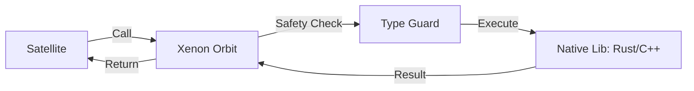

# @gravito/xenon ⚛️

> The High-Performance Native Orbit - Secure FFI & Memory Management for Gravito.

`@gravito/xenon` is a specialized orbit designed to bridge the gap between high-level TypeScript logic and low-level native libraries (.so, .dll, .dylib). It provides a **Safe FFI (Foreign Function Interface)** wrapper with rigorous memory management and boundary protection.

## 🌟 Features

- 🛡️ **Safe FFI**: Invoke native C/Rust functions with built-in type guards and boundary checks.
- 🧠 **Memory Management**: Track buffer ownership (Owned vs Borrowed) to prevent memory leaks and double-frees.
- ⚡ **Zero-Copy Performance**: Optimized data transfer between Bun's JavaScript engine and native memory.
- 🌌 **Galaxy-Ready**: A native Gravito Orbit that exposes the `XenonManager` to the entire Galaxy.
- 🔍 **Observability**: Built-in memory tracking and stats for monitoring native resource usage.
- 🛠️ **Type-Safe Bindings**: Define your native symbols using TypeScript interfaces for full IDE support.

## 📦 Installation

```bash
bun add @gravito/xenon
```

## 🚀 Quick Start

### 1. Register the Orbit

Add `OrbitXenon` to your Gravito application:

```typescript
import { PlanetCore } from '@gravito/core';
import { OrbitXenon } from '@gravito/xenon';

const core = new PlanetCore();
const xenon = new OrbitXenon({
  // Configuration options
});

xenon.install(core);
```

### 2. Load a Native Library

Define the symbols (functions) you want to import from your native library:

```typescript
// Define the symbols
const symbols = {
  add: {
    args: ['i32', 'i32'],
    returns: 'i32'
  },
  process_data: {
    args: ['buffer', 'size_t'],
    returns: 'void'
  }
};

// Load the library
const lib = await core.xenon.load('path/to/library.so', symbols);

// Call native functions
const sum = lib.symbols.add(10, 20);
console.log(`Sum from C: ${sum}`);
```

### 3. Safe Buffer Handling

Xenon manages memory safely, ensuring that buffers passed to native code are valid and correctly sized.

```typescript
import { createOwnedBuffer } from '@gravito/xenon';

const buffer = createOwnedBuffer(1024);
lib.symbols.process_data(buffer.ptr, buffer.size);

// Xenon tracks ownership and ensures safety
```

## 🌌 Role in Galaxy Architecture

In the **Gravito Galaxy Architecture**, Xenon acts as the **Native Bridge**.

- **Performance Satellites**: Satellites that require extreme computational power (e.g., Image Processing, Cryptography, AI Inference) use Xenon to delegate tasks to native code.
- **System Integration**: Provides a secure way for Orbits to interact with OS-level APIs that are not exposed by the Bun runtime.



## 📚 Documentation

- [🏗️ **Xenon Architecture**](./doc/ARCHITECTURE.md) — Internals and memory safety rules.
- [🔗 **FFI Guide**](./doc/FFI_GUIDE.md) — How to write and bind native libraries.
- [🧠 **Memory Management**](./doc/MEMORY.md) — Understanding buffer ownership and tracking.

## 📄 License

MIT © Carl Lee
