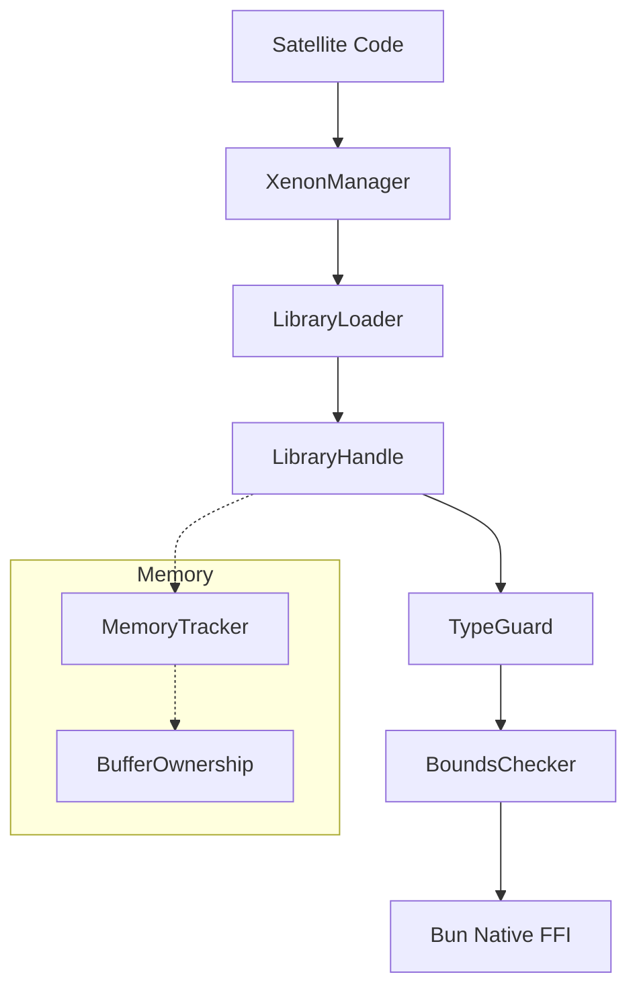

# Xenon Architecture

`@gravito/xenon` is built on the philosophy of **"Safe Native Interop"**. It solves the problem of "Bun crashes when FFI is used incorrectly" by adding a protective layer between JavaScript and the Foreign Function Interface.

## 1. The Protection Layers

When you call a native function through Xenon, it passes through three layers of validation:

### A. Type Guard Layer
Ensures that the arguments passed from JavaScript match the `FFISymbolDef`. If you pass a string where an `i32` is expected, Xenon throws a `XenonTypeError` instead of letting the native code receive garbage and segfault.

### B. Bounds Checker Layer
For functions that take buffers or pointers, Xenon verifies that the pointer is within a valid memory range and that the provided size doesn't exceed the buffer's allocated length.

### C. Resource Lifecycle Layer
Tracks every loaded library and allocated buffer. When `XenonManager` is closed, it ensures all library handles are released and all owned buffers are accounted for, preventing resource leaks.

## 2. Component Diagram

## 3. Buffer Ownership Model

Xenon distinguishes between two types of memory:

1. **Owned Buffers**: Memory allocated by Xenon/Bun. Xenon is responsible for freeing it or ensuring it's not accessed after being freed.
2. **Borrowed Buffers**: Memory provided by the native library (e.g., a pointer returned from C). Xenon tracks these as "Borrowed" and performs read-only safety checks.

## 4. Error Handling

Xenon uses a specialized hierarchy of errors to help you debug native issues:
- `XenonLibraryError`: Failed to load `.so/.dll`.
- `XenonTypeError`: Argument mismatch.
- `XenonMemoryError`: Out of bounds or use-after-free.
- `XenonSecurityError`: Attempt to access restricted memory regions.
