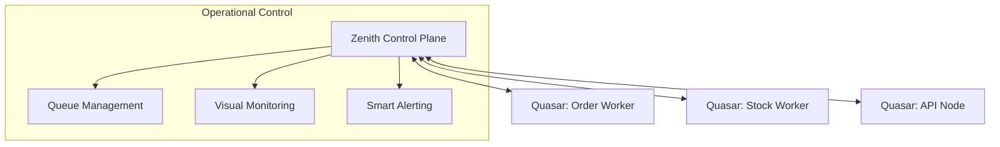

# @gravito/zenith (Flux Console) 🧭

> Zero-config Control Plane and Monitoring Dashboard for Gravito Flux & Stream.

`@gravito/zenith` (also known as **Flux Console**) is the official management interface for Gravito's asynchronous ecosystem. It provides real-time visibility into your queues, workers, and background jobs, enabling powerful operational control with zero configuration.

## ✨ Key Features

- **🧭 Galaxy-Wide Monitoring**: Centralized dashboard for visualizing throughput, error rates, and latencies across all Satellites.
- **🎮 Operational Control**: Real-time management of queues, workers, and background jobs with zero configuration.
- **👷 Worker Health**: Cluster-wide tracking of CPU, RAM, and uptime for all active Gravito service instances.
- **♻️ Dead Letter Queue (DLQ) Ops**: Single-click batch retry or clearing of failed jobs across the system.
- **🔍 Distributed Auditing**: Deep search through historical jobs stored in SQL or Redis throughout the Galaxy.
- **🚨 Unified Alerting**: Integrated Slack and Discord notifications for critical system thresholds and failure spikes.

## 🌌 Role in Galaxy Architecture

In the **Gravito Galaxy Architecture**, Zenith acts as the **Control Plane (Navigational Command)**.

- **Galaxy Insight**: Provides the "Cockpit" for developers and SREs to observe and manage the internal state of the asynchronous ecosystem.
- **Remote Orchestration**: Enables remote control of background processes without needing direct terminal access to the production nodes.
- **Telemetry Aggregator**: Works with `Quasar` agents to consolidate metrics and logs from isolated Satellites into a single operational view.



## 📦 Installation

```bash
bun add @gravito/zenith
```

Or run directly using `bunx`:

```bash
bunx zenith
```

## 🚀 Quick Start

### 1. Launch the Dashboard

You can start the console using the built-in CLI. It will automatically connect to your local Redis.

```bash
# Start on default port 3000
bunx zenith start

# Custom configuration via env vars
REDIS_URL=redis://production:6379 DB_DRIVER=mysql zenith start
```

### 2. Configure Monitoring

Register the **Pulse** agent in your Gravito application to report health metrics to Zenith.

```typescript
import { PlanetCore } from '@gravito/core'
import { OrbitStream } from '@gravito/stream'
import { QuasarAgent } from '@gravito/quasar' // Metrics reporter

const core = await PlanetCore.boot({
  orbits: [
    OrbitStream.configure({ /* ... */ }),
  ],
})

// Start reporting to Zenith
const agent = new QuasarAgent({ service: 'orders-worker' })
await agent.start()
```

## 🛠️ Configuration

| Env Var | Default | Description |
|---|---|---|
| `PORT` | `3000` | The port to run the dashboard on. |
| `REDIS_URL` | `redis://localhost:6379` | Connection string for your queue backend. |
| `DB_DRIVER` | `sqlite` | Persistence driver for job history (`sqlite` or `mysql`). |
| `AUTH_PASSWORD` | `none` | If set, enables password protection for the UI. |

## 🧩 Dashboard Sections

- **Overview**: High-level cluster health and job throughput.
- **Queues**: Detailed state of individual queues and job inspection.
- **Workers**: Live list of active process nodes and their resource usage.
- **Pulse**: Real-time heartbeat monitoring for all service instances.
- **Schedules**: Cron job definitions and execution history.
- **Metrics**: Long-term historical data for capacity planning.

## 🤝 Contributing

We welcome contributions! Please see our [Contributing Guide](../../CONTRIBUTING.md) for details.

## 📄 License

MIT © Carl Lee
